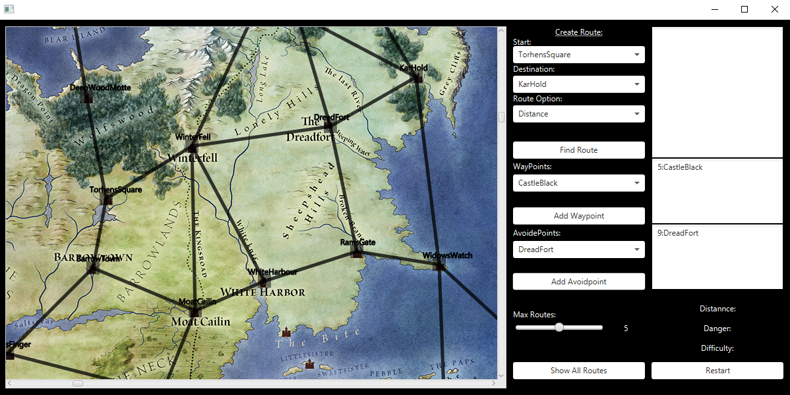

# Data Structures and Algorithms 2

CA Exercise 2 – A Song of Ice and Fire (Game of Thrones) Route Finder

“Create a route finder for the known world of A Song of Ice and Fire (Game of Thrones) series.”
The objective of this team CA exercise is to create an interactive application that can search for and
retrieve various routes between specified towns/cities in the “known world” as depicted in George R
R Martin’s A Song of Ice and Fire book series, which is the basis for the TV series Game of Thrones.

# Dijkstra's Algorithm

Dijkstra's algorithm (or Dijkstra's Shortest Path First algorithm) is an algorithm for finding the shortest paths between nodes in a graph. For a given source node in the graph, the algorithm finds the shortest path between that node and every other. It can also be used for finding the shortest paths from a single node to a single destination node by stopping the algorithm once the shortest path to the destination node has been determined.

